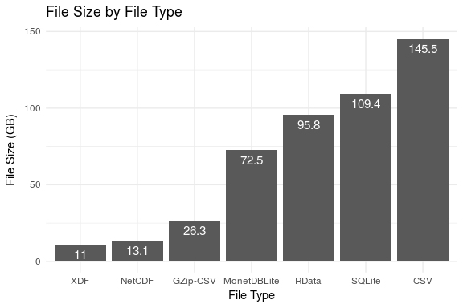
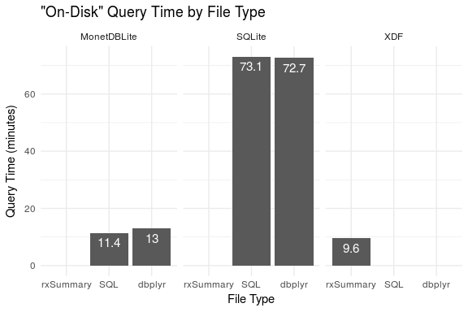
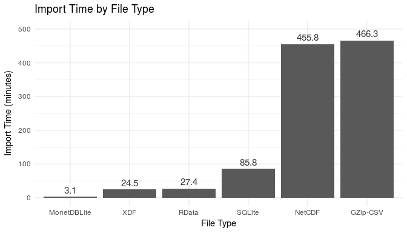
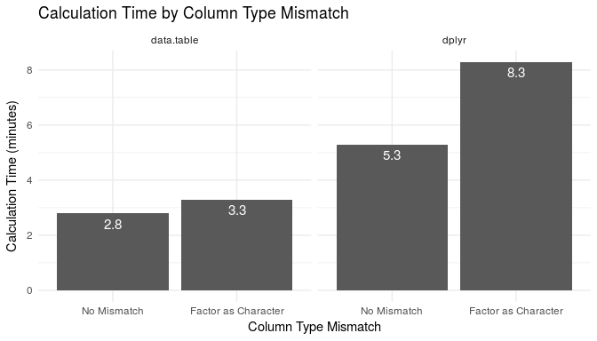
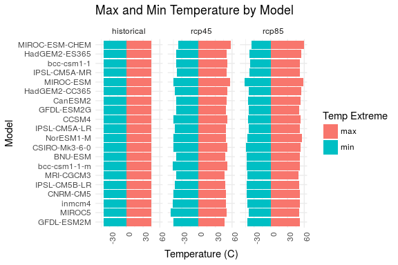

# Big Data File Formats
Brian High and Miriam Calkins  
November 17, 2017  

## Introduction

This is a brief introduction to the management of "Big Data" in R using 
file-based databases to work around limitations in volatile memory (RAM).

Storage, either on disk or the network, is usually much cheaper than RAM, 
but also much slower to access. If the size of your data set exceeds your 
available RAM, it might be worth using file-based solutions. They will 
often be easier to implement than database servers, computing clusters, or 
cloud options. They will allow you to work with datasets about twice as 
big as the amount of RAM you have available. You can work with even bigger 
datasets if you can work with only a subset or sample of the full dataset.

### File Formats

We will compare the following file formats and their performance:

* [RData](https://stat.ethz.ch/R-manual/R-devel/library/base/html/load.html)
* [CSV](https://en.wikipedia.org/wiki/Comma-separated_values)
* [SQLite](https://en.wikipedia.org/wiki/SQLite)
* [MonetDBLite](https://en.wikipedia.org/wiki/MonetDB)
* [XDF](https://docs.microsoft.com/en-us/machine-learning-server/r/concept-what-is-xdf)

We chose to focus on MonetDBLite and XDF because of positive reviews and 
benchmark studies which indicate they work well for large data sets. We tried 
SQLite to compare with MonetDBLite and Feather to compare with XDF. Reading 
our [Feather](https://blog.rstudio.com/2016/03/29/feather/) files crashed our 
R session, so we abandoned that format for this study. We compared with CSV and 
GZipped CSV, as those are familiar formats that we suspected would perform 
poorly, but we wanted to see for ourselves. Likewise, RData is a familiar 
format for R users, as it is the native R format for saving workspace data 
objects. Like XDF, RData stores R objects and allows for compression. Unlike 
XDF, support for RData is found in all versions of R.

### Packages

We will also be using these R packages:

* [data.table](https://cran.r-project.org/web/packages/data.table/index.html)
* [dplyr](https://cran.r-project.org/web/packages/dplyr/index.html)
* [dbplyr](https://cran.r-project.org/web/packages/dbplyr/index.html)
* [RevoScaleR](https://docs.microsoft.com/en-us/machine-learning-server/r-reference/revoscaler/revoscaler)
* [DBI](https://cran.r-project.org/web/packages/DBI/index.html)
* [RSQLite](https://cran.r-project.org/web/packages/RSQLite/index.html)
* [MonetDBLite](https://cran.r-project.org/web/packages/MonetDBLite/index.html)
* [pryr](https://cran.r-project.org/web/packages/pryr/index.html)

### Case Study: Exploratory Data Analysis of Meteorological Data

We will be working with an ongoing research project using meteorological data 
as an example case study. In particular, we will use climate data from the 
[MACA downscaling](https://climate.northwestknowledge.net/MACA/) datasets. Our 
goal is to find which file types will be the most efficient for working with 
data from this source, when merged into datasets containing about two billion 
rows each. This size represents 150 years of daily observations and projects 
for geographic grid locations in Washington State for one climate model. 

We will look at 20 models, so a total of about 40 billion rows of data. If 
stored as plain text CSV files, this would consume almost 3 terabytes (TB) of 
disk space. If imported into R, this would use more than 1.5 TB of memory. 
Fortunately, we only need to work with one model at a time. Even so, we would
still consider this "Big Data", as we would need at least 180 GB of memory to 
store one model's data in memory and perform basic statistical operations on 
it. Most computer systems, aside from large servers, do not have this much 
memory.

## Big Data

What is Big Data?

For our purposes, we are using the term "Big Data" in a broad, general sense. 
This will be our working definition of "Big Data":

> Big Data means data of such volume, velocity, or variety such that the use of 
> special tools and techniques will be necessary in order to manage it effectively.

For this project, we will focus on Big Data _volume_. So how much volume is 
"Big"? While some consider "Big Data" to mean terabytes (TB) or petabytes (PB) 
of data, that is simply what is big relative to their experience and resources. 
What is big for R users?

Many statistical software programs, R included, load working datasets into 
volatile memory (RAM). When you import a CSV file into a data frame, that data
frame is stored in RAM while you have it open in your R session. Most R users 
will not know how to work with data that they cannot load into data frames or 
other common R data structures like vectors, lists, arrays, and matrices. 

To most R users, any dataset that is bigger than about one half the amount of 
RAM in their computer system is a big dataset. Any larger, and there would be 
little room left in RAM for performing statistical operations, for example. For 
most desktop workstations and laptops purchased in the past few years, this 
would be datsets of two to four gigabytes (GB) or more. Even if you have access 
to a large, powerful server with lots of RAM, you still will be limited to 
datasets that can fit in this amount of RAM. At this time, servers with more 
RAM than, say, 128 or 256 GB may not be readily available to many R users, 
without having to go outside of their organization's computing environment. 

So, even if you have access to a large server with 256 GB of RAM, you will 
begin to have trouble working with datasets over about 128 GB in size. For you,
this has become "Big Data", because now you have to find another way to work 
with this large amount of data.

### Common Approaches to Big Data Volume

We will take advantage of most of these tools and techniques in our case study.

* Sampling
* Bigger hardware
* Storage (e.g., files or databases) and "chunking"
* Optimized software compilation to support hardware features
* Alternative libraries (packages)
* Alternative interpreters
* Alternative languages

(Modified from [Five ways to handle Big Data in R](https://www.r-bloggers.com/five-ways-to-handle-big-data-in-r/) by Oliver Bracht.)

### Optimized Software Compilation

We will use [Microsoft R Client](https://docs.microsoft.com/en-us/machine-learning-server/r-client/what-is-microsoft-r-client) which 
[includes](http://blog.revolutionanalytics.com/2014/10/revolution-r-open-mkl.html) 
the Intel Math Kernel Library (MKL), which provides implicit parallelization for 
mathematical operations. To make use of this library, this version of R was 
[compiled](https://software.intel.com/en-us/articles/using-intel-mkl-with-r) 
to support this library. Further, Microsoft R Client offers implicit 
parallelization with up to two threads for _RevoScaleR_ functions. To use more 
threads with these functions, one would need to use the Microsoft ML Server.

Many R packages make use of code written in other languages and some packages 
are compiled on your machine when they are installed, perhaps taking advantage 
of special hardware features.

## Data Source

_Miriam Calkins_, the primary data analyst for our case study writes:

> The climate data is from the 
> [MACA downscaling](https://climate.northwestknowledge.net/MACA/) 
> model. It produces daily data at a 1/24th resolution (note: the CIG met data 
> is at a 1/16th resolution) for 6 variables of interest over a 150 year period. 
> The files are downloaded in ~5 year chunks for each variable and climate input 
> model (GCM). I'm restricting the geographic area to WA State. For this project 
> we will probably only use ~10 GCMs for the final ensemble, but there are a 
> total of 20 available that I would like to look at quickly (using only 1 
> variable) for model selection. There are also two projection scenarios 
> (RCP 4.5 and 8.5) that I will be using which means that all data from 
> 2006-2099 will have duplicate files."

### Getting the Data

The files were downloaded using Bash scripts generated and downloaded from the 
[MACA Data Portal](https://climate.northwestknowledge.net/MACA/data_portal.php) 
website. The bash scripts contain _wget_ or _curl_ commands which download the
individual NetCDF files, one for each variable, 5-year period, and scenario, 
containing historical observations and model projections of daily averages for
the geographic region selected, Washington State. Over 20,000 geographic 
locations (lat/lon pairs) are represented in the data files for this region.

## Requirements Analysis

We will describe the process of elucidating and analyzing our requirements in 
these areas:

* Access/Security Requirements
* Software Requirements
* Storage Requirements
* Memory Requirements
* Processing Requirements
* Performance Requirements

### Access Requirements

The primary user of the data will be the data analyst. A few other collaborators
may want access to the data files, but summary reports may be sufficient for 
them. The data analyst will need access to the data files from whichever system 
will be used for data analysis. A shared folder on the network storage system 
may suffice. Remote access from off-campus will not be necessary. Many of our 
servers can be accessed remotely anyway, via Remote Desktop Gateway. The data 
are not sensitive, so no special security precautions will be need be taken.

### Software Requirements

We are choosing to use R for data management and analysis, based on previous 
familiarity and experience. We can use it at no financial cost and it can run 
on the various operating systems we already use in our department. We have a 
reasonable expectation that R will be able to handle our project, based on 
previous experience and the reports of others.

### Storage Requirements

Initially, we downloaded 2000 [NetCDF](http://www.unidata.ucar.edu/software/netcdf/docs/faq.html) 
files, covering 20 models, three "scenarios", and two "variables" (with three 
"dimensions"). As each NetCDF file consumed about 145 MB of storage space on 
average, the 2000 files consumed a total of about 283 GB.

If we would only need to work with a few NetCDF files at a time, then this might
be all of the space we would need, at least for the initial analysis of these
20 models and two variables. But we wanted to merge all of the 100 files for 
each model into a single dataset for each model. We wanted to save these merged
datasets into separate files for later analysis. Since the data for each model 
consumes about 145 GB when exported to CSV formated files, we would need up to
3 TB of additional storage space if we used this format. Clearly, this format 
does not store data as efficiently as NetCDF, which takes less than 1/10th the
space as compared to CSV.

One of our goals was to evaluate other file types to see if we could reduce 
this storage requirement. For example, each of those CSV files can be compressed 
with _gzip_ to a size of about 26 GB, for a total consumption of about 520 GB for 
all 20 model datasets. That is approximately 80% savings in storage. So, keeping 
the original NetCDF files, plus adding the merged and compressed CSVs would 
require a total of about 800 GB. Considering we might need some additional 
scratch space, we allocated 1 TB for this project's network storage folder.

We will compare the performance of a variety of file types: GZipped CSV, 
MonetDBLite, SQLite, XDF, and RData. So, we will need to store these other types, 
as least at long as it takes to test them. For our 20 merged datasets, we have 
found space consumption to be, per dataset: CSV = 146 GB, GZipped CSV = 26 GB, 
MonetDBLite = 73 GB, SQLite = 109 GB, XDF = 11 GB, RData = 96 GB. 

Since the uncompressed RData format takes so much more space than XDF, but 
offers no additional benefits, and lacks "on-disk" query features or any other 
memory-saving or performance enhacing features, and suffers from poor storage 
and retrival times when using compression, we chose not to store a complete set 
of RData files. Likewise, we also found the performance of CSV, GZipped CSV, 
and SQLite to be poor for our datasets. Therefore, we decided to only store a 
complete set of MonetDBLite (1,460 GB) and XDF (220 GB) files. Since the 
MonetDBLite files grow as they are used, we allowed for this by putting just 
those files on a 1.77 TB drive. We will still have to remove completed models as 
we evaluate each new model, to allow for file expansion.

### Memory Requirements

We will only need to evaluate one model at a time, initially for the two 
temperature variables, "tasmax" and "tasmin". Those, plus the date, latitude,
longitude, and scenario ("historical", "rcp45", or "rcp85"). For each model, 
there are about 2 billion rows of these six variables. When stored on disk
as a CSV file, as noted above, this consumes 145 GB. When a model is loaded
into memory as a data frame, it consumes about 84 GB of RAM if our one character
variable is converted to a factor and the date is stored as a `date`. It uses 
less space in RAM because the numerical values, dates, and factors can be stored 
as numbers instead of characters. In some cases R will use more memory to store
your dataset, especially of you have a lot of small numerical values. In our 
dataset, we have decimal numbers with many digits, which are more efficiently 
stored as `numeric` values than as `character` values in R.

For example, given 2 billion rows and 6 columns, our data might consume: 

    As stored in CSV:  (2*10^9)*(16+16+16+16+10+7)/1024^3 = 151 GB
    As stored in RAM:       (2*10^9)*(8+8+8+8+8+8)/1024^3 =  90 GB

Where each `character` uses 1 byte, each `numeric` value (stored as a 64-bit 
double-precision floating point number) uses 8 bytes of RAM, and one gigabyte 
is 1024^3 bytes. Each numeric value uses 16 characters in our CSV file, 
including the decimal. The date is formatted as YYYY-MM-DD, so it uses 10 
characters in the CSV. We estimate each value of our only character variable 
will use 7 bytes on average in the CSV and 8 bytes in RAM. We have not counted 
the characters used for delimiters and end-of-line (EOL) characters, nor have 
we adjusted for missing values. We are assuming these will mostly cancel out. 
It would be [more complicated](http://adv-r.had.co.nz/memory.html) to calculate 
this accurately, but we are just roughly estimating our needs and this simple 
method will often be good enough.

To perform basic operations on this data frame, we would want to have at least 
90 * 2 = 180 GB of RAM available for our analysis, plus extra memory available 
for the system and other users if we will be using a shared resource. As 180 
GB of RAM is far more than we have on desktop workstations and laptop computers, 
we will be using a server or server cluster. Since these systems are shared in 
our department, we would not want to use more than about half of its available
memory, so we should try to find a system with about 360 GB of available RAM 
or more. For example, a server that has 512 GB of RAM and is lightly used would 
probably work okay if we were careful about our memory consumption.

### Processing Requirements

R will generally use only one CPU core by default. We can use libraries which 
are optimized for multiple cores, such as those included with Microsoft R Open.
There are also libraries that allow one to parallelize operations, but we will
not be using those, initially anyway, as our main bottleneck will be data 
transfer to and from storage (i.e., "I/O") and this is much slower as compared 
to RAM or CPU speeds. Later we may wish to speed up analysis time with 
additional parallelization features if we find we need to perform many 
operations on each model and processing time becomes a significant issue.

### Performance Requirements

While we have no fixed performance criteria, we would like data transfer and
processing to be as fast as reasonably possible without too much extra work. 
Although it is okay if unattended processes, like data merging, take a few hours 
or days, we would like analysis operations to be fast enough for nearly 
"interactive" use. This means we would like queries and aggregation of summary 
statistics to take no more than a few minutes per model. Loading data from 
storage into memory should also take no more than a few minutes per model, if 
possible, but this can take a little longer than queries performed on data 
stored in memory. We will use high-performance packages like _data.table_, 
_dplyr_ and _RevoScaleR_ to speed execution.

### Resource Allocation

Fortunately we have access to a server with 512 GB of RAM and 32 CPU cores. It 
also has an additional 2 TB of local storage available for temporary use. It 
runs Windows Server 2008 R2, 64 bit. We will use up to 1.5 TB of the local 
storage and will try to keep our memory consumption to no more than 256 GB. 
Most of the time, will only be using a few CPU cores, so load on the system 
should not be significant. By using local storage, we will reduce load on the
network.

## File Comparison Test Results

For this project we were not too concerned about the time it takes to write the
files since we would be automating this as a batch and would only need to write 
the merged files once.

What was of more concern was the amount of space the files would take, how long
it would take to query them "on disk" and how long it would take to read entire 
files into memory. Once in memory, we were also interested in how long it would 
take to summarize the data, so we compared _dplyr_ and _data.table_ for this, as
we knew from previous experience those packages were good performers and easy 
to use.

### File Size

We found the two SQL database formats, SQLite and MonetDBLite to consume similar
amounts of space, about the same as RData and almost as much as the CSV format. 
XDF and GZipped CSV were noticeably smaller, due to compression. We saw the 
MonetDBLite file size grow appreciably after a few queries had been performed. 
This is because that file format will reindex itself according to your queries.

<!-- -->

## On-Disk Queries

### Benchmark Operation

Our benchmark query was a simple filter/group/summarize operation expressed 
in SQL as:

    SELECT scenario, 
           MAX(tasmax) AS maxtmax, 
           MIN(tasmin) AS mintmin  
    FROM metdata 
    WHERE NOT tasmax = 0 AND NOT tasmin = 0 
    GROUP BY scenario;

Where `maxtmax` is the maximum of the daily maximum temperatures and 
`mintmin` is the minimum of the daily minimum temperatures.

This query is equivalent to this _dplyr_ pipeline:

    df %>% filter(tasmax != 0, tasmin != 0) %>% 
           group_by(scenario) %>% 
           summarise(maxtmax=max(tasmax, na.rm = TRUE), 
                     mintmin=min(tasmin, na.rm = TRUE))

Or this _data.table_ operation:

    dt[tasmax != 0 & tasmin != 0, 
       .(maxtmax=max(tasmax, na.rm = TRUE), 
         mintmin=min(tasmin, na.rm = TRUE)), 
       by = list(scenario)]

With XDF, we can use the _rxSummary_ function: 

    rxSummary(~tasmax:scenario + tasmin:scenario, 
              data=xdf.dso, removeZeroCounts = TRUE, 
              summaryStats=c("Max", "Min"))

But to get the output formatted as in the previous examples, we use _dplyr_ 
to reformat it:

    df.rxs$categorical[[1]][c('scenario', 'Max')] %>% 
        full_join(df.rxs$categorical[[2]][c("scenario", 'Min')],
                  by = 'scenario') %>% 
        rename(maxtmax=Max, mintmin=Min) %>% mutate(model=mod)

Where `df.rxs` is the `data.frame` object we used to store the output of 
_rxSummary_.

### Query Performance

MonetDBLite was much faster to query than SQL. XDF was fast too, but it's 
query features are more limited compared to the rich expressiveness of SQL.

<!-- -->

## File Import Times

MonetDBLite was the fastest to import by far. SQLite and GZipped CSV took much 
to long to read to be considered competitive with the others.

<!-- -->

## "In-Memory" Calculation Time

_data.table_ is faster than _dplyr_ for our benchmark summary operation. Making 
sure factors are coded as factors instead of characters can really help, especially 
when using _dplyr_. Specify column types as you import, as it will take a long 
time to convert after import.

<!-- -->

## Max and Min Temperatures

It takes about 3 hours and 12 minutes to summarize all of the data using XDF files
and _rxSummary_. 

<!-- -->

## Summary

By gathering project requirements first, then evaluating various options that
fit those requirements, we were able to find two primary data file types to use:
MonetDBLite and XDF. 

Both will perform similarly in terms of speed, with XDF taking less storage 
space but more time to read into memory. If the operations to be performed 
will consume too much memory, then MonetDBLite will also allow some of the 
calculations to be performed in SQL before loading the entire dataset into 
memory. Or, either file type can be subsetted during import to implement a 
"chunking" approach. So, if minimizing storage consumption is a priority, then 
we may prefer XDF, but if execution time and memory conservation are priorities, 
then we may prefer MonetDBLite.

It is quicker to import our data into a `data.frame` rather than converting to 
a `data.table` during or after import. But using the _data.table_ bracket-notation
for some operations will be faster than performing those same operations with 
_dplyr_ functions. So, if we have lots of operations to perform in memory, it 
may be worth the overhead of converting data frame's to data tables in order 
to use the _data.table_ package.
