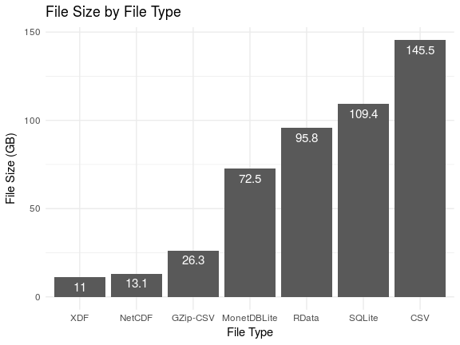
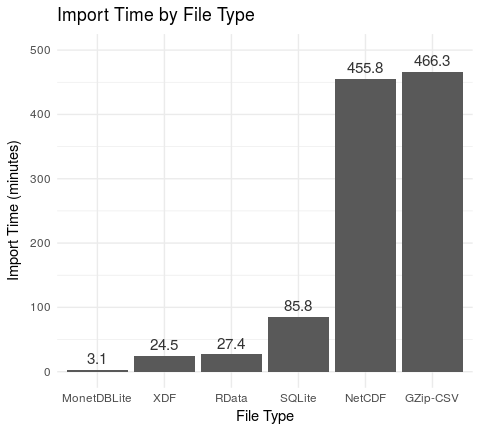

# Big Data File Formats
Brian High and Miriam Calkins  
  

## Introduction

We define Big Data broadly as "data so big it becomes difficult to manage".

This difficulty can be related to the "Three Vs":

* Volume
* Velocity
* Variety

With a case study, we will show how we managed Big Data Volume in R.

## Case Study: Meteorological Data

We are using climate data from the 
[MACA downscaling](https://climate.northwestknowledge.net/MACA/) model. 

* 20 models
* 150 years per model
* 3 "scenarios" per model
* 2 billion rows per model
* 2000 NetCDF files consuming 290 gigabytes (GB)
* would be 3 terabytes (TB) as CSV
* would be 1.5 TB when loaded into memory (RAM)

## File Formats

We compared the following file formats and their performance:

* [RData](https://stat.ethz.ch/R-manual/R-devel/library/base/html/load.html)
* [CSV](https://en.wikipedia.org/wiki/Comma-separated_values)
* [SQLite](https://en.wikipedia.org/wiki/SQLite)
* [MonetDBLite](https://en.wikipedia.org/wiki/MonetDB)
* [XDF](https://docs.microsoft.com/en-us/machine-learning-server/r/concept-what-is-xdf)

## Packages

We will used these R packages:

* [data.table](https://cran.r-project.org/web/packages/data.table/index.html)
* [dplyr](https://cran.r-project.org/web/packages/dplyr/index.html)
* [dbplyr](https://cran.r-project.org/web/packages/dbplyr/index.html)
* [RevoScaleR](https://docs.microsoft.com/en-us/machine-learning-server/r-reference/revoscaler/revoscaler)
* [DBI](https://cran.r-project.org/web/packages/DBI/index.html)
* [RSQLite](https://cran.r-project.org/web/packages/RSQLite/index.html)
* [MonetDBLite](https://cran.r-project.org/web/packages/MonetDBLite/index.html)
* [pryr](https://cran.r-project.org/web/packages/pryr/index.html)

## Common Approaches to Big Data

We used most of these tools and techniques in our case study.

* Sampling
* Bigger hardware
* Storage (e.g., files or databases) and "chunking"
* Optimized software compilation to support hardware features
* Alternative libraries (packages)
* Alternative interpreters
* Alternative languages

(Modified from [Five ways to handle Big Data in R](https://www.r-bloggers.com/five-ways-to-handle-big-data-in-r/) by Oliver Bracht.)

## Requirements Analysis

To select the best tools for the job, we considered:

* Security/Access Requirements
* Software Requirements
* Storage Requirements
* Memory Requirements
* Processing Requirements
* Performance Requirements

## File Size

The SQL-based formats were about the size as RData, with XDF and GZipped CSV 
much smaller and uncompressed CSV much larger.

<!-- -->

## On-Disk Queries

MonetDBLite was much faster than SQL. XDF was fast too, but it's query features 
are more limited compared to the expressiveness of SQL.

<!-- -->

## File Import Times

MonetDBLite was the fastes to import bay far. SQLite and GZipped CSV took much 
to long to read to be considered competitive with the others.

<!-- -->

## "In-Memory" Calculation Time

_data.table_ is faster than _dplyr_. Making sure factors are coded as factors 
instead of characters can really help, especially when using _dplyr_. Specify 
column types as you import, as it will take a long time to convert after import.

<!-- -->

## Max and Min Temperatures

It takes about 3 hours and 12 minutes to summarize all of the data:

<!-- -->

## Summary

By gathering project requirements first, then evaluating various options that
fit those requirements, we were able to find two primary data file types to use:
MonetDBLite and XDF. 

Both will perform similarly in terms of speed, with XDF taking less storage 
space but more time to read into memory. If the operations to be performed 
will consume too much memory, then MonetDBLite will also allow some of the 
calculations to be performed in SQL before loading the entire dataset into 
memory. Or, either file type can be subset during import to implement a 
"chunking" approach. So, if minimizing storage consumption is a priority, then 
we may prefer XDF, but if execution time or memory conservations are priorities, 
then we may prefer MonetDBLite.

It is quicker to import our data into a `data.frame` rather than converting to 
_data.table_ during or after import. But using the _data.table_ bracket-notation
for some operations will be faster than performing those same operations with 
 _dplyr_ functions. So, if we have lots of operations to perform in memory, it 
 may be worth the overhead of converting data frame's to data tables in order 
 to use the _data.table_ package.
 
